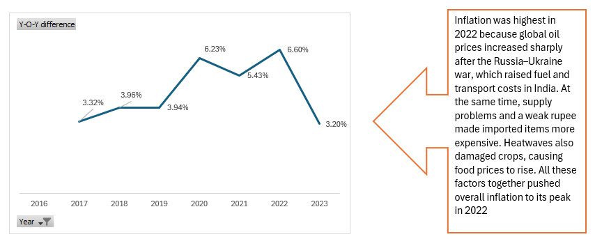
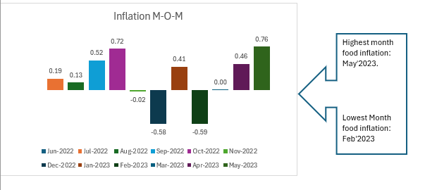
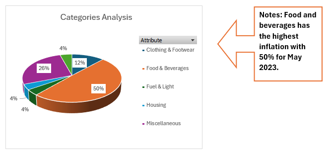

# CPI Inflation Analysis - India

## 📌 Project Overview

This project analyzes India's Consumer Price Index (CPI) data to derive meaningful insights into inflation trends. The analysis focuses on identifying the contribution of major categories such as food, energy, and transportation towards overall CPI, along with examining month-on-month and year-on-year changes.

The study further explores trends in food inflation over a 12-month period, highlighting volatility, key patterns, and its impact on overall inflation. Additionally, the project includes an assessment of broader economic factors such as the COVID-19 pandemic and global crude oil price fluctuations to understand their influence on inflation in India.

Overall, the project aims to provide a data-driven understanding of inflation dynamics and the key factors affecting price movements in the Indian economy.

---

## 🎯 Objective

* Analyze CPI trends over time
* Identify contribution of major categories to overall inflation
* Study food inflation patterns and volatility
* Understand impact of external factors like COVID-19 and crude oil prices

---

## 🛠 Tools Used

* Microsoft Excel
* Pivot Tables
* Data Cleaning
* Charts & Visualization

---

## 📊 Key Analysis

* Analyzed CPI (Rural + Urban combined) data across multiple years
* Evaluated contribution of broader categories (Food, Energy, etc.) to CPI
* Calculated month-on-month (MoM) changes in Food & Beverages
* Performed trend analysis to identify inflation patterns
* Studied the impact of COVID-19 and global oil price fluctuations on inflation

---

## 📊 CPI Inflation Trend (YoY)

Inflation peaked in 2022 due to a sharp rise in global oil prices following the Russia–Ukraine war, increasing fuel and transportation costs. Supply chain disruptions, a weaker rupee, and heatwaves further pushed food prices higher.

---

## 📉 Month-on-Month Inflation

This chart highlights short-term fluctuations in inflation, showing periods of increase and decline driven mainly by changes in food prices.

---

## 🥧 Category Contribution

Food & Beverages contributed the highest share to inflation, indicating its major impact on overall CPI.

---

## 📈 Key Insights

* Food inflation showed higher volatility compared to overall CPI, indicating its strong influence on inflation trends
* There were noticeable periods of sharp increase and decline in food prices
* Inflation trends were significantly impacted during the COVID-19 period, showing structural shifts
* External factors such as crude oil price fluctuations influenced inflation across multiple categories
* Food prices remain a key driver of short-term inflation movements in India

---

## 📂 Dataset

* CPI data (Rural + Urban combined)

---

## 🚀 Conclusion

The analysis highlights that fluctuations in food prices and external economic factors significantly impact overall inflation trends in India. Understanding these patterns helps in better economic planning and decision-making.

---

Created by Rahul Chhabra

